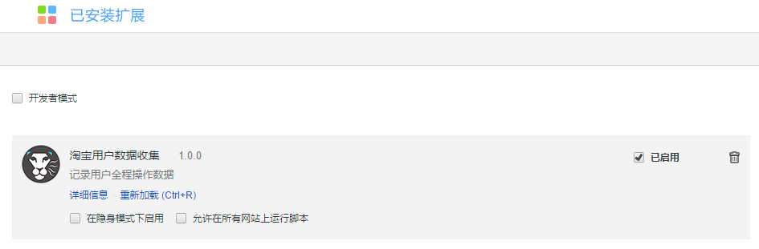
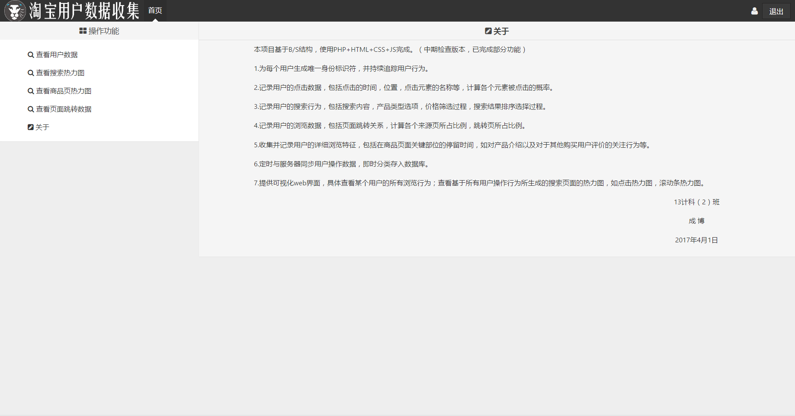
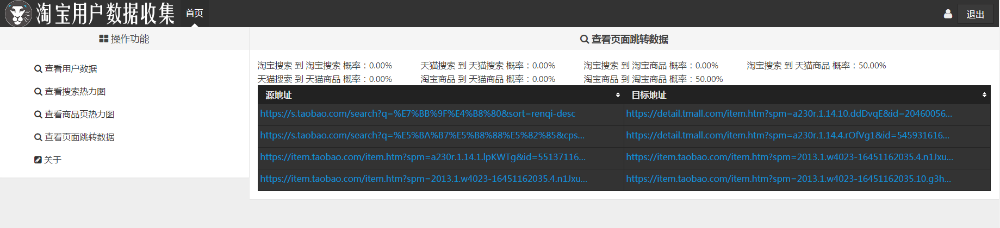
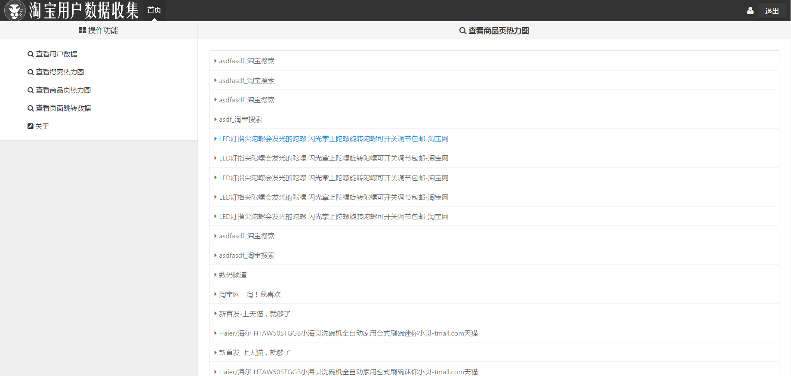
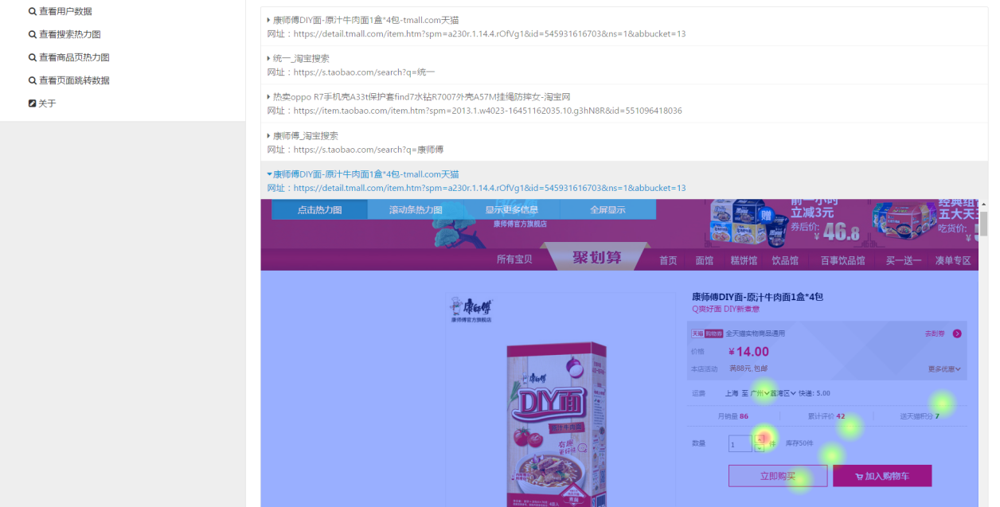
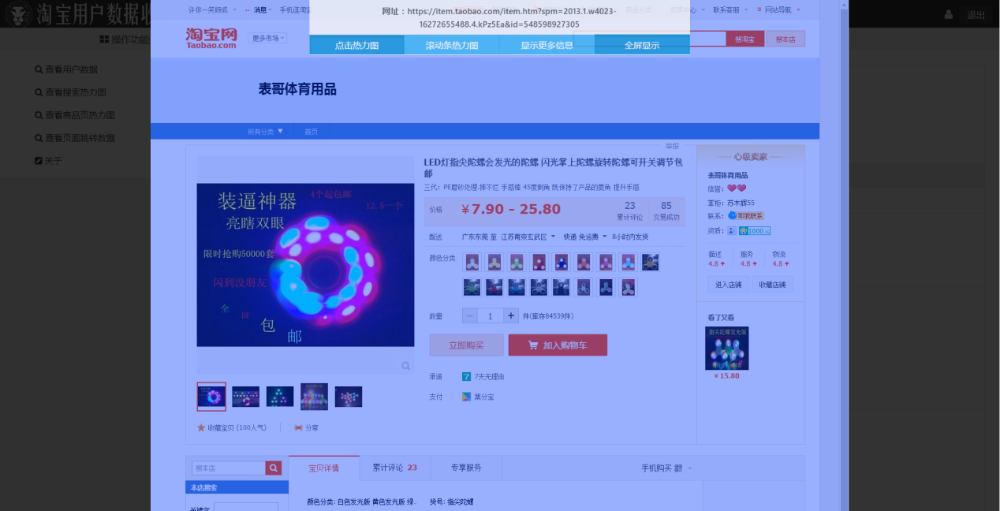
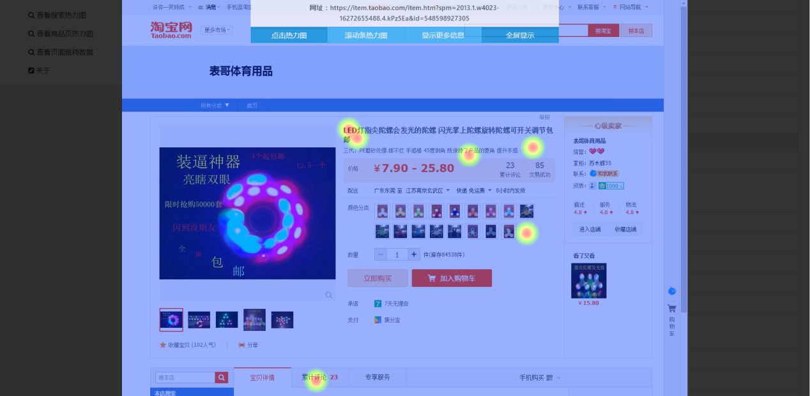
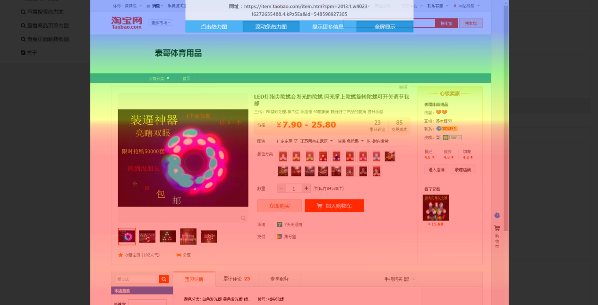
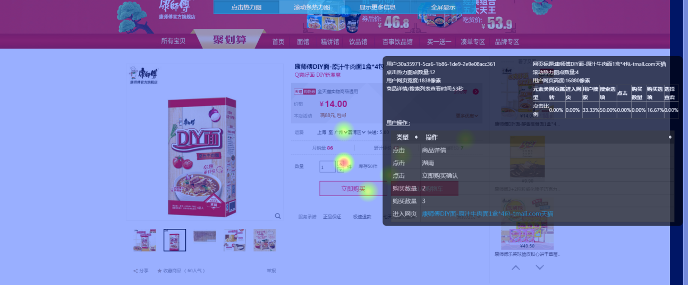
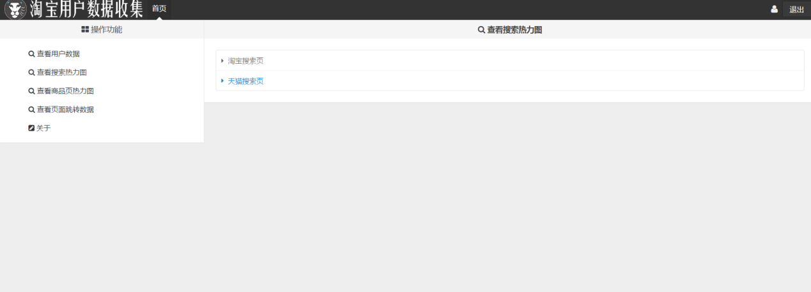

# 电商用户行为记录分析插件

采用 BS 形式，程序分为客户端（Chrome
浏览器插件与浏览器）和服务器端两部分。涉及编程语言有JavaScript、CSS、HTML、PHP。浏览器给用户操作提供环境，将操作数据提交给浏览器插件。Chrome
浏览插件记录用户访问行为并过滤记录再将访问记录发送到服务器端。服务器端记录用户访问记录，存储于MySQL。服务器端接收到查询后，输出Json格式数据。浏览器访问指定页面从而获取服务器中的Json数据，再将Json数据渲染为易于查看的样式。
能掌握用户在网站上操作的大部分有意义细节，可以从用户来源渠道、进入网站、浏览商品、加入购物车、提交购物车、创建订单、支付订单等各个环节进行监控，找到数据流失的关键节点，进行改进。不需要对繁杂数据进行分析，分析的计算消耗由用户计算机承担，服务器接收的是经过筛选后的格式化数据，并能对其进行任意处理。通过对用户的操作数据进行合理分析与归纳，我们可以得到用户的行为习惯，为营销活动的设计提供数据基础。与此同时，结合网站设计原理与营销原理，网站设计人员与营销人员将更容易发现网站、推广渠道等企业营销环境所存在的设计问题与内容问题，从而对网站的结构设计与活动设计进行优化，增加页面内对用户的有效信息，减少用户不必要的点击，提高网站易用性，让企业的营销更加精准、有效，提高业务转化率与存留率，最终实现网站盈利的增长。

详细功能列表
------------

1.为每个用户生成唯一身份标识符，并持续追踪用户行为。

2.记录用户的点击数据，包括点击的时间，位置，点击元素的名称等，计算各个元素被点击的概率。

3.记录用户的搜索行为，包括搜索内容，产品类型选项，价格筛选过程，搜索结果排序选择过程。

4.记录用户的浏览数据，包括页面跳转关系，计算各个来源页所占比例，跳转页所占比例。

5.收集并记录用户的详细浏览特征，包括在商品页面关键部位的停留时间，如对产品介绍以及对于其他购买用户评价的关注行为等。

定时与服务器同步用户操作数据，即时分类存入数据库。

7.提供可视化web界面，具体查看某个用户的所有浏览行为；查看基于所有用户操作行为所生成的搜索页面的热力图，如点击热力图，滚动条热力图。

系统测试
========

1 插件端测试
------------

### 1.1 安装插件界面

当插件安装完成后，用户浏览器的右上角会出现图标

图1 安装插件界面

### 1.2 记录状态提示

安装插件后，用户在访问淘宝或天猫页面时，会在记录操作时在页面左上角产生提示

图2 界面提示

### 1.3 页面过期提示

当用户超过20分钟没有在查看页面，将直接结束监控，释放内存，并给出提示。

图3 页面过期提示

2 后台端测试
------------

### 2.1 主界面

主界面展示了本项目的任务书。

图4 主界面

### 2.2 查看页面跳转数据

在本界面可以查看所有用户的网页跳转数据，并由此显示跳转页面的方向与比例。

图5 页面跳转数据

### 2.3 查看商品页面热力图

本页面可以查看任意记录商品页的热力图以及详细的操作信息。

图6 查看商品页面热力图

预览查看状态下，工具栏会漂浮在页面左上角，简单查看页面的热力图。

图7 预览查看

全屏查看状态下，会智能根据用户的屏幕显示，保证管理员在查看任意分辨率的用户时都能获得正确的视窗。

图8 全屏查看

点击热力图展示了用户在页面上的任意点击，由红到蓝，暖色到冷色，显示点击密度的多到少。

图9 商品页面点击热力图

滚动条热力图展示了用户在页面上视觉的聚焦区域，能显示出用户关注的内容，停留时间越长，颜色越偏向红色，反之则偏向蓝色。

图10 商品页面点击滚动热力图

查看更多信息栏中显示出了该用户在当前页面对于埋点的操作，如更改购买数量，点击购买等，并能计算出各种操作所占比例。

图11 查看更多信息图

### 2.4 查看搜索页面热力图

在本界面可以选择查看搜索页面的综合数据，根据屏幕大小进行分类。实现多用户的搜索界面操作的聚合显示，体现出用户的平均选择与喜好。

图12 查看搜索页面热力图
