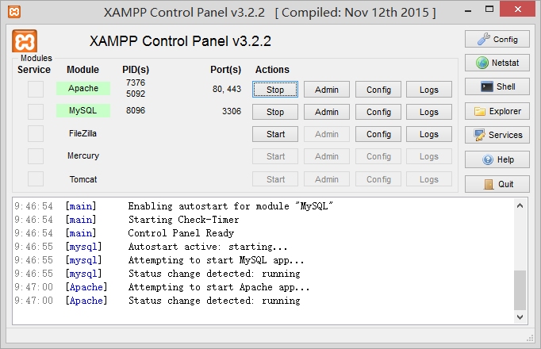
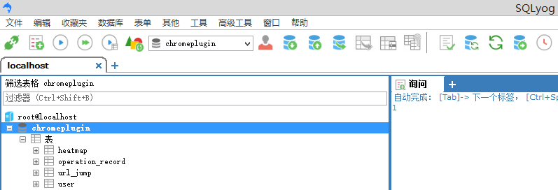
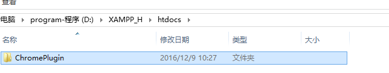
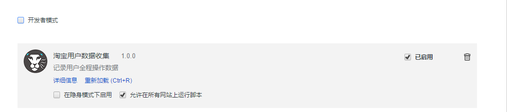
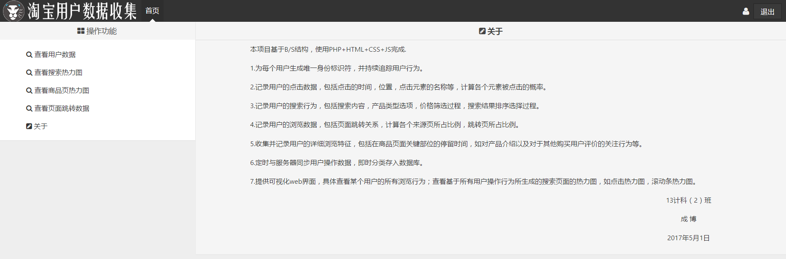

### 安装Apache与MySQl服务(测试可使用XAMPP)

### 导入chromeplugin.sql，将用户名与密码均设置为root，数据库设置为chromeplugin

### 在Apache 的htdocs目录中新建文件夹chromeplugin，将 源程序\\服务器端源代码 中的所有文件放入

### 在Chrome浏览器中安装 源程序\\淘宝用户监测插件.crx（推荐使用360极速浏览器安装），如无法安装，请在Chrome浏览器快捷方式启动参数中添加一条：--enable-easy-off-store-extension-install。然后进入 chrome://extensions/ 扩展管理界面，将 crx 插件拖进去，即可完成安装。

### 正常在淘宝页面中浏览购物，若以上4步正确完成，访问http://localhost/chromeplugin 即可查看后台页面。

